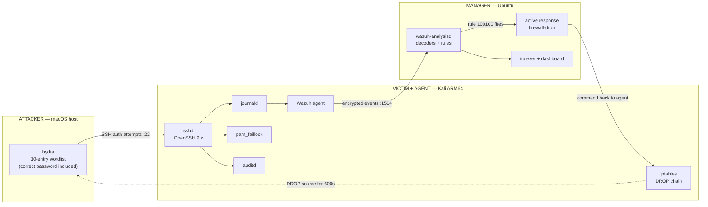

<h1 align="center">Wazuh SSH Brute-Force Detection &amp; Prevention</h1>

<p align="center">
  <em>A correct password, sitting in the attacker's wordlist, that never works.</em>
</p>

<p align="center">
  
  
  
  
  
  
</p>

---

## Overview

A blue-team lab on a **real distributed deployment** — three separate hosts, not a
single-box tutorial. An attacker brute-forces SSH against a monitored victim; Wazuh
correlates the failures into one high-severity alert and then enforces two independent
controls that stop the attack.

The design makes the outcome **falsifiable rather than illustrative**: the correct password
is deliberately placed at line 8 of the attacker's wordlist. `hydra` still reports
`0 valid password found`, because the account locks at attempt 3 and the source IP is
dropped moments later. The credential is present, correct, and useless.

**What this project demonstrates**

- Writing a **custom Wazuh correlation rule** (`frequency` + `same_source_ip`) and validating it
- Root-causing why the rule ID used by nearly every published example **fails silently** — and proving the correct one from the stock ruleset
- Wiring **active response** to turn detection into automated enforcement
- Identifying the **timing gap** in reactive blocking (measured: ~2s) and layering a pre-emptive control that closes it
- Independent forensic recording with **auditd**, including watches on the controls themselves
- Documenting **limitations honestly** — evasion paths, false-positive profile, what was not tested

> **Addressing note.** Every address in this repository is a placeholder
> (`<attacker-ip>`, `<victim-ip>`, `<manager-ip>`). Live IPs, hostnames, raw Wazuh
> output, dashboard exports and terminal recordings are redacted or excluded from
> version control — see [`evidence/README.md`](evidence/README.md).

---

## Architecture



| Role | OS | Runs |
|------|----|------|
| **Attacker** | macOS host | `hydra` |
| **Victim / Agent** | Kali (ARM64) | `sshd`, Wazuh agent, `pam_faillock`, `auditd`, `iptables` |
| **Manager** | Ubuntu | Wazuh manager, indexer, dashboard |

Full topology and pipeline breakdown → **[docs/ARCHITECTURE.md](docs/ARCHITECTURE.md)**

---

## Detection

Individual failed logins are noise. Detection is **correlation**:

```xml
<rule id="100100" level="10" frequency="3" timeframe="120">
  <if_matched_sid>5760</if_matched_sid>
  <same_source_ip />
  <description>SSHD brute force: 3 failed login attempts from same source IP $(srcip)</description>
  <group>authentication_failures,pci_dss_10.2.4,pci_dss_10.2.5,</group>
</rule>
```

Five lines — and the interesting part is `5760`, not the `5716` used by most write-ups. In
the stock ruleset, `5760` declares `<if_sid>5700,5716</if_sid>`: it is a **more specific
child** of 5716. Wazuh files the alert under the most specific matching rule, so
`<if_matched_sid>5716</if_matched_sid>` never accumulates. The rule does not error or warn —
it simply never fires, which is the worst failure mode a detection can have.

Full write-up, including how to confirm the SID in your own environment →
**[docs/DETECTION.md](docs/DETECTION.md)**

---

## Prevention — two layers, because one has a gap

Active response is **reactive**. Measured from the captured evidence, the round-trip from
detection to enforcement is **~2 seconds**:

```
06:45:01.597   rule 100100 fires    (manager correlates 3 failures)
06:45:03.617   alert 651            (iptables DROP applied on agent)
                ~2.0s
```

`hydra -t 4` keeps guessing throughout that window — and if the manager is down, the block
never arrives at all. So the network layer is containment, not the guarantee.

| | Layer 1 — network | Layer 2 — account |
|---|---|---|
| Mechanism | Active response → `iptables` DROP | `pam_faillock` (`deny=3`) |
| Decision made on | Manager | Victim, locally |
| Timing | **Reactive** — ~2s round-trip | **Pre-emptive** — inside the auth path |
| Scope | That source IP, all services | That account, from any source |
| Survives manager outage? | **No** | **Yes** |
| Bypassed by | Rotating source address | Targeting a different account |

`pam_faillock`'s `preauth` module runs **before** `pam_unix` evaluates the password, so a
locked account refuses **even valid credentials**. Their weaknesses are complementary,
which is the whole argument for layering.

Configuration, PAM stack ordering traps, and the auditd forensic layer →
**[docs/PREVENTION.md](docs/PREVENTION.md)**

---

## Results

| Metric | Value |
|--------|-------|
| Failures to trigger detection | **3** within 120s |
| Detection latency (3rd failure → alert) | **sub-second** |
| Enforcement latency (alert → iptables DROP) | **~2.0s** |
| Attack attempts collapsed into one alert | **10 → 1** |
| Correct password confirmed by hydra | **No** |
| False positives during the run | **0** |

Timeline, per-source verification, host-side confirmation, and a frank list of
limitations (slow-attack evasion, source rotation, password spraying) →
**[docs/RESULTS.md](docs/RESULTS.md)**

---

## Key signals

| ID | Meaning |
|----|---------|
| `5760` | sshd: authentication failed (single event) |
| `100100` | **Custom** — SSH brute force, 3 failures from one source IP |
| `651` | Host blocked by `firewall-drop` (active response) |

Dashboard filter: `rule.id:(5760 OR 100100 OR 651)`

MITRE ATT&CK: [T1110](https://attack.mitre.org/techniques/T1110/) ·
[T1110.001](https://attack.mitre.org/techniques/T1110.001/) ·
[T1021.004](https://attack.mitre.org/techniques/T1021.004/)

---

## Repository layout

```
rules/local_rules.xml                    # detection rule 100100          (manager)
decoders/local_decoder.xml               # additive decoder, annotated    (manager)
manager-ubuntu/ossec-active-response...  # active-response block          (manager)
agent-kali/faillock.conf                 # account lockout policy         (agent)
agent-kali/common-auth.auth-section      # PAM stack wiring               (agent)
agent-kali/ssh-forensics.rules           # auditd forensic watches        (agent)
attack/run-attack.sh, wordlist.txt       # the attack                     (attacker)
evidence/alerts-sample.json              # redacted alert output
docs/ARCHITECTURE.md                     # topology, pipeline, layers
docs/DETECTION.md                        # decoding, the SID problem, correlation
docs/PREVENTION.md                       # both controls + auditd forensics
docs/RESULTS.md                          # timeline, metrics, limitations
docs/RUNBOOK.md                          # step-by-step build + verification
docs/LESSONS.md                          # what broke, and the fixes
docs/BLOG.md                             # narrative write-up
```

---

## Quick start

Full build and verification → **[docs/RUNBOOK.md](docs/RUNBOOK.md)**. Short version:

```bash
# MANAGER (Ubuntu) — detection rule
sudo cp rules/local_rules.xml /var/ossec/etc/rules/local_rules.xml
sudo /var/ossec/bin/wazuh-analysisd -t          # ALWAYS validate before restarting
sudo systemctl restart wazuh-manager

# MANAGER — active response: merge manager-ubuntu/ snippet into ossec.conf
# AGENT (Kali) — lockout policy, PAM wiring, auditd rules: see RUNBOOK steps 5-6

# ATTACKER
./attack/run-attack.sh <victim-ip>
```

Requires a **private NAT / host-only network** with pinned IPs. A bridged LAN with client
isolation breaks attacker→victim port 22 while leaving agent→manager working — an
asymmetric failure that is genuinely confusing to debug, and one of five documented in
[docs/LESSONS.md](docs/LESSONS.md).

---

## Scope and ethics

An educational lab on an isolated network, targeting a throwaway `demo` account on VMs
under my own control. `hydra` and the bundled wordlist exist to *generate the detection
signal*. Do not point them at systems you are not authorized to test.

## License

[MIT](LICENSE)
