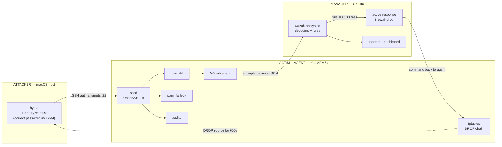
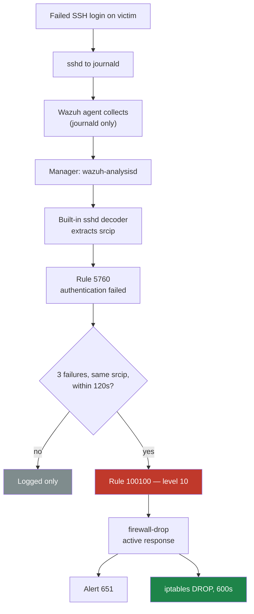

<h1 align="center">Wazuh SSH Brute-Force Detection &amp; Prevention</h1>

<p align="center">
  <em>Detecting an SSH brute-force attack with Wazuh — and stopping it at two independent layers.</em>
</p>

<p align="center">
  
  
  
  
  
</p>

---

## Overview

A blue-team lab built on a **real distributed deployment** — three separate hosts, not a
single-box tutorial. An attacker brute-forces SSH against a monitored victim; Wazuh
correlates the failures into a single high-severity alert and then enforces two
independent controls that stop the attack.

The result that makes it conclusive: **the correct password is deliberately placed in the
attacker's wordlist, and is still never confirmed.** The account locks and the source IP
is dropped before `hydra` ever reaches it.

**What this demonstrates**

- Writing and validating a **custom Wazuh correlation rule** (frequency + `same_source_ip`)
- Diagnosing why a rule copied from tutorials **silently never fires** — and fixing it
- Wiring **active response** to convert detection into automated enforcement
- Understanding why reactive blocking alone is insufficient, and **layering a pre-emptive control**
- Independent forensic recording with **auditd**

> **Addressing note.** Every address in this repository is a placeholder
> (`<attacker-ip>`, `<victim-ip>`, `<manager-ip>`). Live IPs, hostnames and raw
> Wazuh output are redacted and kept out of version control.

---

## Architecture



| Role | OS | Runs |
|------|----|------|
| **Attacker** | macOS host | `hydra` |
| **Victim / Agent** | Kali (ARM64) | `sshd`, Wazuh agent, `pam_faillock`, `auditd`, `iptables` |
| **Manager** | Ubuntu | Wazuh manager, indexer, dashboard |

Full topology, pipeline and layer breakdown: **[docs/ARCHITECTURE.md](docs/ARCHITECTURE.md)**

---

## How it works



1. The victim's sshd logs are collected via **journald** and shipped to the manager over `:1514`.
2. Failed logins decode with Wazuh's built-in `sshd` decoder and classify as rule **5760**.
3. Custom rule **100100** fires on **3 failures from one source IP within 120s**.
4. That single alert drives **two independent controls** (below).
5. **auditd** keeps a separate forensic record, independent of Wazuh.

### Two layers, because one isn't enough

Wazuh active response is **reactive** — it fires only after the event reaches the manager
and the command travels back to the agent. `pam_faillock` needs no such round-trip.

| | Layer 1 — network | Layer 2 — account |
|---|---|---|
| Mechanism | Active response → `iptables` DROP | `pam_faillock` (`deny=3`) |
| Timing | **Reactive** — after manager round-trip | **Pre-emptive** — inside the auth path |
| Scope | Blocks that source IP entirely | Locks that account from any source |
| Needs Wazuh up? | Yes | **No** |
| Duration | 600s | 600s |

Because `pam_faillock`'s `preauth` check runs *before* the password is evaluated, a locked
account refuses **even valid credentials** for the full window.

---

## Key signals

| ID | Meaning |
|----|---------|
| `5760` | sshd: authentication failed (single event) |
| `100100` | **Custom** — SSH brute force, 3 failures from one source IP |
| `651` | Host blocked by `firewall-drop` (active response) |

Dashboard filter: `rule.id:(5760 OR 100100 OR 651)`

---

## The detection rule

```xml
<rule id="100100" level="10" frequency="3" timeframe="120">
  <if_matched_sid>5760</if_matched_sid>
  <same_source_ip />
  <description>SSHD brute force: 3 failed login attempts from same source IP $(srcip)</description>
  <group>authentication_failures,pci_dss_10.2.4,pci_dss_10.2.5,</group>
</rule>
```

Five lines — and the reason it works is `5760`, not the `5716` every tutorial uses. On a
modern OpenSSH build logging through journald, a rule built on `5716` matches nothing and
**fails silently**.

Deploy it on the manager, and validate *before* restarting — a malformed ruleset takes the
whole manager down, not just the new rule:

```bash
sudo cp rules/local_rules.xml /var/ossec/etc/rules/local_rules.xml
sudo /var/ossec/bin/wazuh-analysisd -t          # ALWAYS validate first
sudo systemctl restart wazuh-manager
```

The lab requires a **private NAT / host-only network** with pinned IPs. A bridged LAN with
client isolation breaks attacker→victim port 22 while leaving agent→manager working — an
asymmetric failure that is genuinely confusing to debug.

---

## Repository layout

```
rules/local_rules.xml       # detection rule 100100   (manager)
docs/ARCHITECTURE.md        # topology, pipeline, enforcement layers
```

Agent-side configuration, the active-response block, the attack harness, sanitized alert
evidence and the full runbook are being added as the write-up is completed.

---

## Scope and ethics

An educational lab on an isolated network against a throwaway `demo` account on VMs under
my own control. `hydra` and the included wordlist are here to *generate the detection
signal*; do not point them at systems you are not authorized to test.

## License

[MIT](LICENSE)
