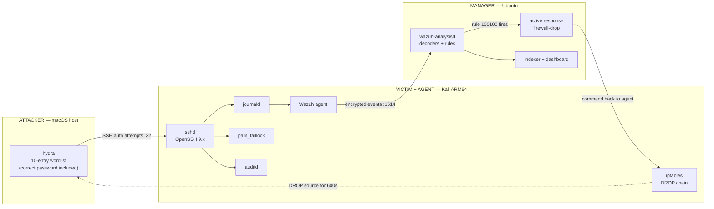
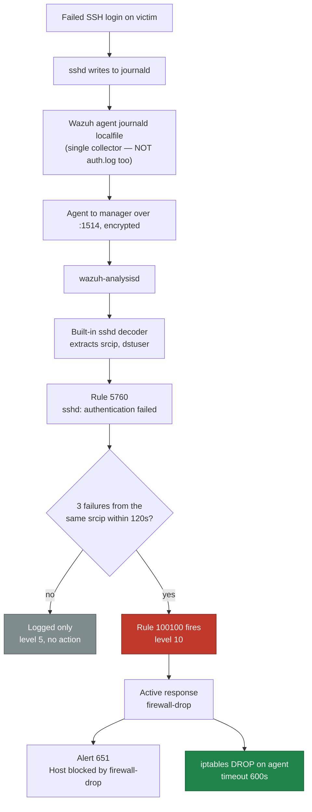
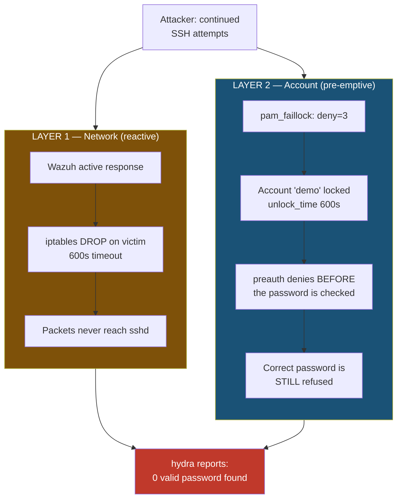

# Architecture

A three-host lab: the attacker, the victim, and the monitoring stack are separate
machines. That separation is the point — detection has to survive a real network hop,
agent enrollment, and a round-trip before it can act.

> **Addressing note.** All addresses in this repository are placeholders
> (`<attacker-ip>`, `<victim-ip>`, `<manager-ip>`). The lab ran on real private
> subnets; live addresses and hostnames are redacted throughout.

---

## 1. Topology



| Role | OS | Runs | Why it matters |
|------|----|------|----------------|
| **Attacker** | macOS host | `hydra` | Generates the attack from a genuinely separate host |
| **Victim / Agent** | Kali (ARM64) | `sshd`, Wazuh agent, `pam_faillock`, `auditd`, `iptables` | Both the target *and* where enforcement executes |
| **Manager** | Ubuntu | Wazuh manager, indexer, dashboard | Decoding, correlation, and the active-response decision |

Network requirement: a **private NAT / host-only network** with pinned IPs. A bridged
LAN with client isolation blocks attacker→victim port 22 while leaving the outbound
agent→manager path working — which fails in a confusing, asymmetric way.

---

## 2. Log and decision pipeline

Where a single failed login goes, and where it turns into enforcement.



The single most important detail: **only one collector.** Adding an `/var/log/auth.log`
localfile alongside journald double-ingests every failure, so a `frequency=3` rule trips
after roughly two real attempts.

---

## 3. Two independent enforcement layers

Active response is **reactive** — it fires only after the event reaches the manager and
the command travels back. That round-trip is why one layer is not enough.



| | Layer 1 — network | Layer 2 — account |
|---|---|---|
| Mechanism | Wazuh active response → `iptables` | `pam_faillock` |
| Runs on | Victim (pushed by manager) | Victim (local, standalone) |
| Timing | **Reactive** — after manager round-trip | **Pre-emptive** — evaluated in the auth path |
| Scope | Blocks that source IP entirely | Locks that account from any source |
| Depends on Wazuh? | Yes | **No** — survives manager outage |
| Duration | 600s (`<timeout>`) | 600s (`unlock_time`) |

Because `pam_faillock`'s `preauth` module runs *before* `pam_unix` evaluates the
password, a locked account rejects even valid credentials. That is what makes the demo
conclusive: the correct password sits in the attacker's wordlist and is never confirmed.

---

## 4. Signals to look for

| ID | Source | Meaning |
|----|--------|---------|
| `5760` | Built-in sshd ruleset | Single failed authentication |
| `100100` | `rules/local_rules.xml` | **Custom** — 3 failures, same source IP, 120s |
| `651` | Active-response ruleset | Host blocked by `firewall-drop` |

Dashboard filter:

```
rule.id:(5760 OR 100100 OR 651)
```

The custom rule itself lives in [`rules/local_rules.xml`](../rules/local_rules.xml).
