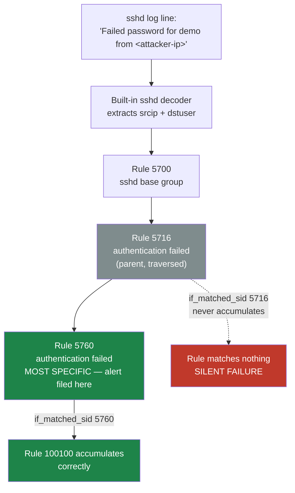
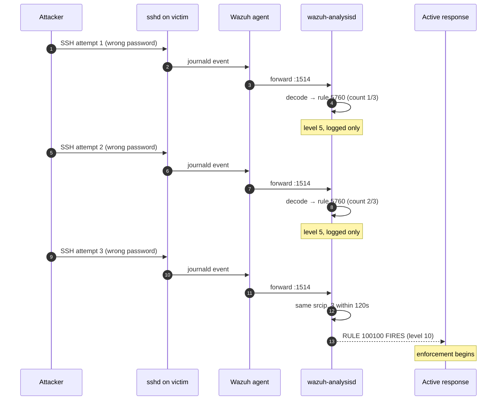
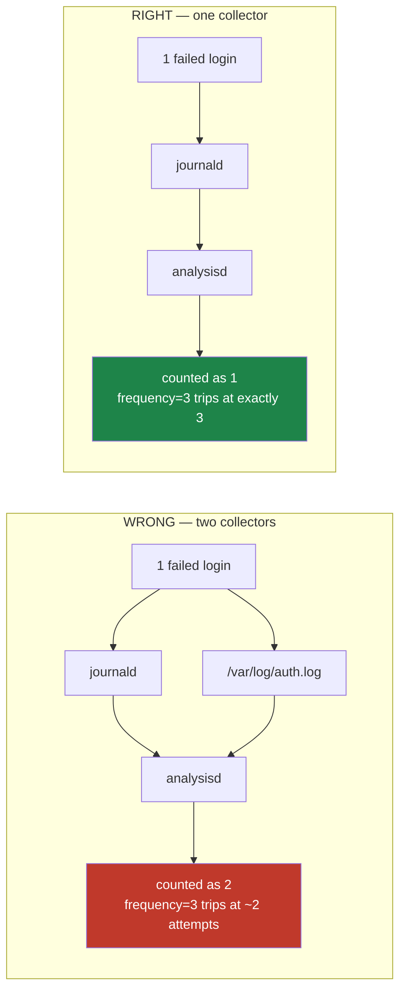

# Detection

How a single failed SSH login becomes one correlated, actionable alert — and why the
rule ID everyone copies from tutorials makes it fail silently.

> All addresses below are placeholders (`<attacker-ip>`, `<victim-ip>`). Live values are
> redacted and kept out of version control.

---

## 1. Decoding: nothing custom is required

Wazuh ships a built-in `sshd` decoder, and it already extracts everything the detection
needs. The parent decoder matches on program name:

```xml
<decoder name="sshd">
  <program_name>^sshd</program_name>
</decoder>
```

Child decoders then pull the fields out of the message body — `srcip`, `dstuser`,
`srcport`. A live failed login on this lab decodes as `decoder: sshd` with `srcip`
populated, which is the only precondition the correlation rule has.

`decoders/local_decoder.xml` in this repo is therefore **optional and additive**. It
re-extracts the same two fields as a child of the built-in decoder purely to make the
logic explicit and reviewable:

```xml
<decoder name="sshd-bruteforce">
  <parent>sshd</parent>
  <prematch>Failed password</prematch>
  <regex offset="after_parent">Failed password for (\S+) from (\S+) port</regex>
  <order>dstuser,srcip</order>
</decoder>
```

### A modern-OpenSSH wrinkle

OpenSSH 9.x splits the daemon into a per-session helper, so log lines arrive with the
program name `sshd-session` rather than `sshd`. The built-in decoder's `^sshd` prematch is
prefix-flexible, so it still matches — but anyone writing a *custom* parent decoder with an
anchored, exact program name will find it silently stops matching on a modern build.

---

## 2. The SID problem

Nearly every published SSH brute-force rule correlates on SID **5716**. On this build a
rule built on 5716 **never fired even once**, while failures were clearly being logged and
alerted. The stock ruleset explains why.

```xml
<!-- 0095-sshd_rules.xml, abridged -->
<rule id="5716" level="5">
  <if_sid>5700</if_sid>
  <match>^Failed|^error: PAM: Authentication</match>
  <description>sshd: authentication failed.</description>
  <mitre><id>T1110</id></mitre>
</rule>

<rule id="5760" level="5">
  <if_sid>5700,5716</if_sid>                     <!-- 5760 is a CHILD of 5716 -->
  <match>Failed password|Failed keyboard|authentication error</match>
  <description>sshd: authentication failed.</description>
  <mitre><id>T1110.001</id><id>T1021.004</id></mitre>
</rule>
```

`5760` declares `<if_sid>5700,5716</if_sid>` — it is a **more specific child** of 5716.
Wazuh evaluates the chain and attributes the event to the most specific rule that matches,
so a `Failed password` line is reported as **5760**, not 5716. 5716 is traversed but is not
the rule the alert is filed under, so `<if_matched_sid>5716</if_matched_sid>` has nothing
to accumulate.



**The generalizable lesson:** never inherit a SID from a write-up. Confirm which rule ID
your *own* environment files the event under before building a frequency rule on it. A
frequency rule pointed at the wrong SID does not error, warn, or log — it just never fires,
which is the worst possible failure mode for a detection.

### Confirming the SID yourself

```bash
# Option A — replay a log line through the rule engine
sudo /var/ossec/bin/wazuh-logtest
# paste a real 'Failed password ...' line; read the reported rule id

# Option B — generate 1 real failure, then read what the manager filed it as
sudo tail -n 50 /var/ossec/logs/alerts/alerts.json \
  | jq -c 'select(.decoder.name=="sshd") | {rule:.rule.id, desc:.rule.description}'
```

---

## 3. The correlation rule

Detection is not "a login failed" — that is a single log line and normal background noise
on any internet-facing host. Detection is **N failures from one source inside a window**.

```xml
<rule id="100100" level="10" frequency="3" timeframe="120">
  <if_matched_sid>5760</if_matched_sid>
  <same_source_ip />
  <description>SSHD brute force: 3 failed login attempts from same source IP $(srcip)</description>
  <group>authentication_failures,pci_dss_10.2.4,pci_dss_10.2.5,</group>
</rule>
```

| Attribute | Value | Why |
|-----------|-------|-----|
| `frequency` | `3` | Three failures — enough to exclude a fat-fingered password |
| `timeframe` | `120` | Within 120s; a slow drip over hours is a different detection |
| `if_matched_sid` | `5760` | Count only decoded sshd auth failures — **not** 5716 |
| `same_source_ip` | — | All three must share one `srcip`, or three unrelated users each failing once would trigger it |
| `level` | `10` | High enough to qualify for active response |
| `group` | `authentication_failures` | Inherits PCI-DSS 10.2.4 / 10.2.5 tagging |

Dropping `same_source_ip` is the most common way to build a false-positive generator: on any
real host, three unrelated failures inside two minutes is routine.

### Correlation over time



---

## 4. One collector, not two

The agent on this lab collects sshd logs via **journald**. Adding a
`/var/log/auth.log` localfile "for redundancy" means every failure is ingested **twice** —
so a `frequency=3` rule trips after roughly two real attempts, and every count in the
system is quietly doubled.



Confirm the agent has exactly one sshd log source before tuning any threshold:

```bash
sudo grep -A3 '<localfile>' /var/ossec/etc/ossec.conf | grep -iE 'journald|auth\.log'
```

More inputs is not more signal — it is a miscalibrated threshold.

---

## 5. MITRE ATT&CK mapping

Inherited from the stock rules this detection builds on:

| Technique | ID | Relevance |
|-----------|-----|-----------|
| Brute Force | [T1110](https://attack.mitre.org/techniques/T1110/) | The parent behaviour |
| Password Guessing | [T1110.001](https://attack.mitre.org/techniques/T1110.001/) | Guessing against a known account (`demo`) |
| Remote Services: SSH | [T1021.004](https://attack.mitre.org/techniques/T1021.004/) | SSH as the attempted access vector |

---

## 6. Validate before restarting

A malformed ruleset does not fail gracefully — `wazuh-manager` refuses to start, which is a
full monitoring outage rather than one broken rule.

```bash
sudo /var/ossec/bin/wazuh-analysisd -t     # must be clean
sudo systemctl restart wazuh-manager
```

The specific trap: `local_rules.xml` **already opens a `<group>`**. Pasting a rule that
brings its own `<group>` wrapper inside it produces `'group' is not a valid element` and
takes the manager down.

The rule itself: [`rules/local_rules.xml`](../rules/local_rules.xml).
Pipeline and topology context: [`ARCHITECTURE.md`](ARCHITECTURE.md).
