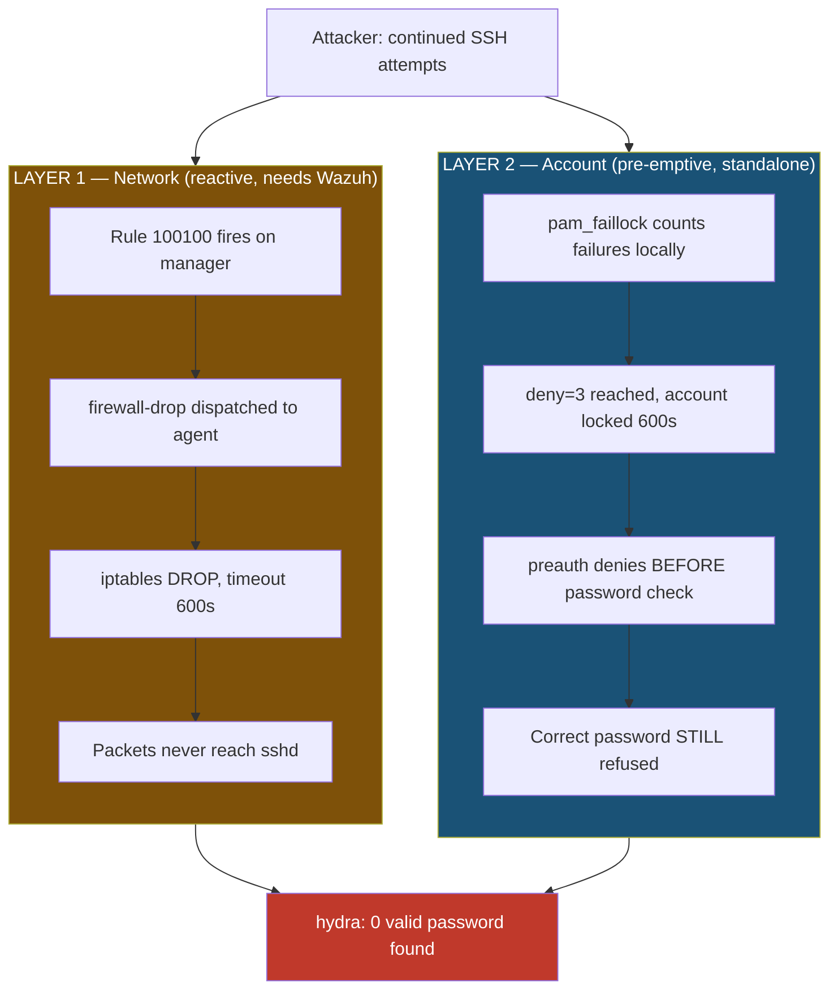
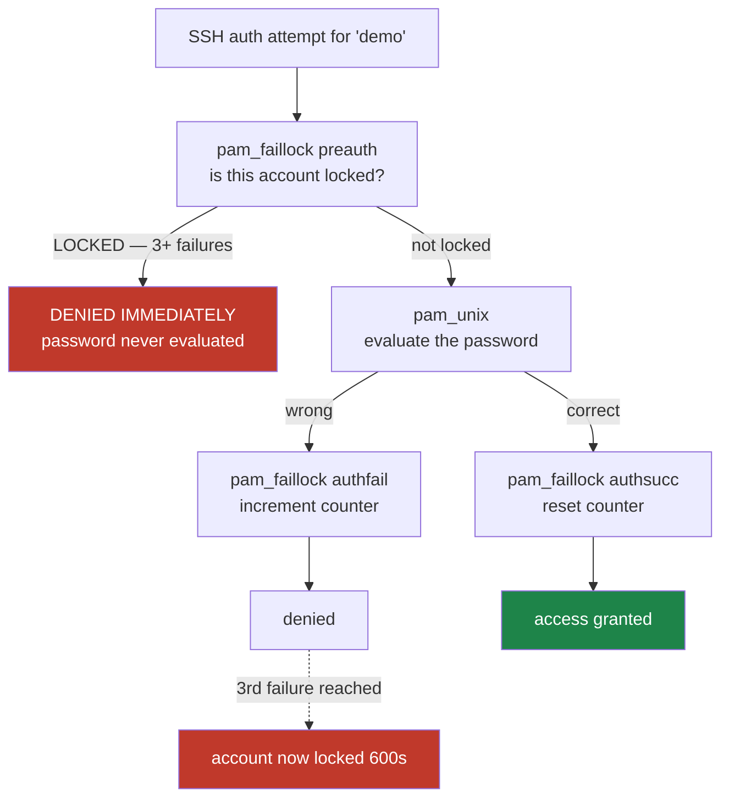

# Prevention

Detection produces an alert. Prevention has to produce a *refusal*. This lab enforces two
controls that fail independently, because the obvious one has a timing gap.

> All addresses below are placeholders. Live values are redacted and kept out of version control.

---

## 1. Why one layer is not enough

Wazuh active response is **reactive**. Nothing happens until the event has travelled agent →
manager, been correlated, and the command has travelled manager → agent. In the captured
evidence that round-trip is about **two seconds**:

```
06:45:01.597   rule 100100 fires        (manager correlates 3 failures)
06:45:03.617   alert 651                (iptables DROP applied on agent)
                ~2.0s window
```

Two seconds is many more SSH attempts. `hydra -t 4` runs four parallel tasks, so the
attacker keeps guessing throughout that window — and if the manager is down, restarting, or
the agent is disconnected, the network block **never arrives at all**.

So the network block is not the guarantee. It is the containment. The guarantee has to live
somewhere that needs no round-trip.



| | Layer 1 — network | Layer 2 — account |
|---|---|---|
| Mechanism | Active response → `iptables` DROP | `pam_faillock` |
| Decision made on | Manager | Victim, locally |
| Timing | **Reactive** — ~2s round-trip | **Pre-emptive** — inside the auth path |
| Scope | That source IP, all services | That account, from any source |
| Survives manager outage? | **No** | **Yes** |
| Duration | 600s (`<timeout>`) | 600s (`unlock_time`) |
| Bypassed by | Changing source address | Targeting a different account |

Their weaknesses are complementary: rotating source IPs defeats layer 1 but not layer 2;
switching target accounts defeats layer 2 but not layer 1.

---

## 2. Layer 1 — network block via active response

Two `<command>` definitions and one binding, added inside the existing top-level
`<ossec_config>` in `/var/ossec/etc/ossec.conf` on the **manager**:

```xml
<command>
  <name>firewall-drop</name>
  <executable>firewall-drop</executable>
  <timeout_allowed>yes</timeout_allowed>
</command>

<active-response>
  <command>firewall-drop</command>
  <location>local</location>
  <rules_id>100100</rules_id>
  <timeout>600</timeout>
</active-response>
```

| Setting | Value | Why |
|---------|-------|-----|
| `location` | `local` | Run on the **agent that reported the event** — the attacker's packets must be dropped at the victim, not the manager |
| `rules_id` | `100100` | Only the correlated alert triggers this. Binding to `5760` would block on a single typo'd password |
| `timeout` | `600` | Auto-reverts after 600s, matching `unlock_time` on the agent |
| `timeout_allowed` | `yes` | **Required** on the command, or `<timeout>` is ignored and the block never expires |

`host-deny` is also defined in the config but deliberately **not** wired to a rule.
`firewall-drop` is preferred because `iptables` discards the packet before `sshd` ever sees
it, whereas `hosts.deny` depends on the daemon honouring TCP wrappers.

Full annotated file: [`manager-ubuntu/ossec-active-response.snippet.xml`](../manager-ubuntu/ossec-active-response.snippet.xml)

### Verify

```bash
# [AGENT] the action was received and executed
sudo tail -n 20 /var/ossec/logs/active-responses.log

# [AGENT] the DROP rule actually exists
sudo iptables -L INPUT -n | grep <attacker-ip>

# [MANAGER] alert 651 was raised
sudo tail -n 80 /var/ossec/logs/alerts/alerts.json \
  | jq -c 'select(.rule.id=="651") | {id: .rule.id, srcip: .data.srcip}'
```

---

## 3. Layer 2 — account lockout via pam_faillock

`/etc/security/faillock.conf` on the **agent**:

```ini
deny = 3
fail_interval = 900
unlock_time = 600
```

| Setting | Value | Meaning |
|---------|-------|---------|
| `deny` | `3` | Lock after 3 consecutive failures |
| `fail_interval` | `900` | Failures counted within a 900s window |
| `unlock_time` | `600` | Auto-unlock after 600s — no admin action needed |

### The PAM stack is order-sensitive

This is the part that actually matters, and getting the order wrong silently disables the
control. From `/etc/pam.d/common-auth`:

```
auth    required                        pam_faillock.so preauth
auth    [success=1 default=ignore]      pam_unix.so nullok
auth    [default=die]                   pam_faillock.so authfail
auth    sufficient                      pam_faillock.so authsucc
auth    requisite                       pam_deny.so
auth    required                        pam_permit.so
```



`preauth` runs **before** `pam_unix` evaluates the password. Once the account is locked,
the attempt is refused at that first step — so **a correct password is refused too**, for
the full 600s window. That is what makes the demonstration conclusive rather than
suggestive.

Ordering traps:
- `preauth` **must** come before `pam_unix`. Placed after, the password is checked first and a valid credential is accepted on a locked account — the control appears configured but does nothing.
- `authfail` **must** be `[default=die]`. As `required`, the stack continues and the counter can be bypassed.
- Keep a **second root shell open** while editing this file. A malformed `common-auth` can lock you out of the host entirely.

### Verify

```bash
sudo faillock --user demo          # expect 3 failures listed, Valid = V
sudo faillock --user demo --reset  # clear between runs
```

---

## 4. Forensic layer — auditd

Neither control above produces an independent record: the Wazuh trail depends on the agent
and the manager. `auditd` writes locally, in the kernel audit subsystem, on a path an
attacker would have to tamper with separately.

Watches deployed via [`agent-kali/ssh-forensics.rules`](../agent-kali/ssh-forensics.rules):

| Target | Key | Catches |
|--------|-----|---------|
| `execve` syscalls | `exec_trace` | Commands run after any successful compromise |
| `/etc/ssh/sshd_config`, `sshd_config.d/` | `sshd_config_changes` | SSH hardening being reverted |
| `/etc/passwd`, `/etc/shadow`, `/etc/group` | `*_changes` | Account creation, password changes |
| `/etc/pam.d/`, `faillock.conf` | `pam_changes`, `faillock_config_changes` | **The lockout control itself being disabled** |
| `/root/.ssh/authorized_keys`, `/home/<user>/.ssh/authorized_keys` | `ssh_authorized_keys_*` | SSH key persistence |
| `/var/log/auth.log` | `auth_log_tampering` | Log wiping |

Watching `faillock.conf` and `/etc/pam.d/` is the point worth noting — an attacker with root
would disable the lockout before continuing, and that action is itself the detection.

```bash
sudo cp agent-kali/ssh-forensics.rules /etc/audit/rules.d/ssh-forensics.rules
sudo systemctl enable --now auditd && sudo auditctl -e 1
sudo augenrules --load && sudo auditctl -l     # confirm loaded
sudo ausearch -k exec_trace --start recent
```

Syntax note: per-user `authorized_keys` watches must be written as individual `-w` lines.
The `-w dir=/home` + relative `path=` form is invalid and is rejected at load time.

---

## 5. Combined result

With both layers active, `hydra` runs a wordlist that **contains the correct password** and
still reports:

```
0 valid password found
```

The credential is present, correct, and useless — the account is locked before the wordlist
reaches it, and the source is dropped at the network layer moments later.

Detection side: [`DETECTION.md`](DETECTION.md) · Topology: [`ARCHITECTURE.md`](ARCHITECTURE.md)
